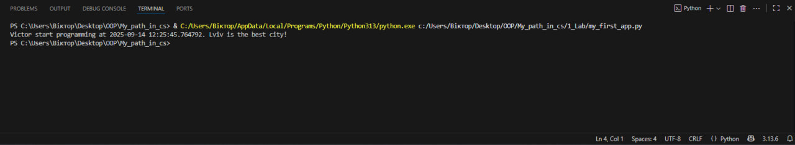
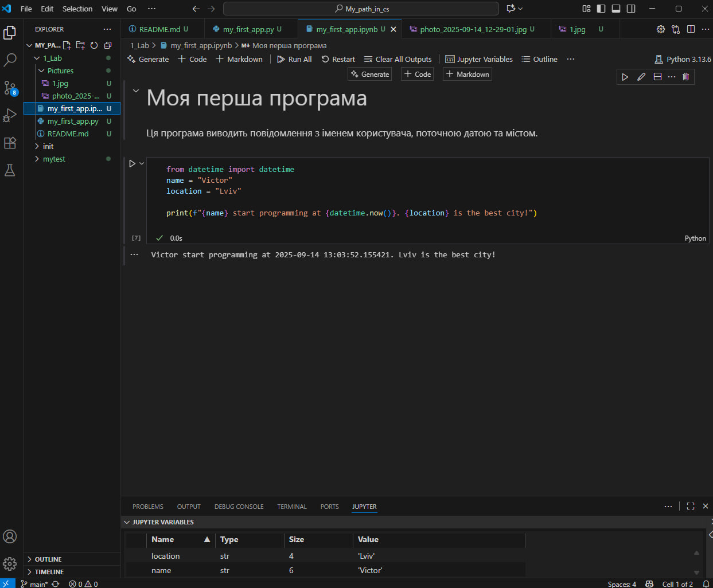
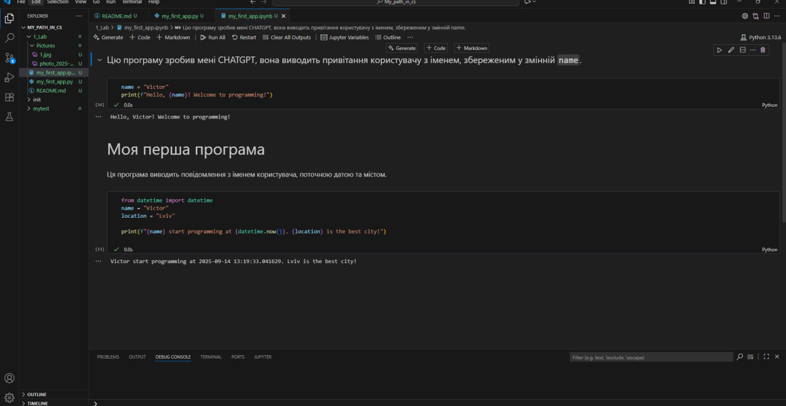

# Звіт до роботи
## Тема: _Оформлення робіт та перша програма_
### Мета роботи: _Навчитися оформляти звіти_

---
### Виконання роботи
    ✅Під час роботи було виконано три роботи з використанням Python codu and MarkDown комірками✅.


* вставлений код №1

```python
from datetime import datetime
name = "Victor"
location = "Lviv"

print(f"{name} start programming at {datetime.now()}. {location} is the best city!")
```

    << Код успішно виконаний >>

* результати виконання індивідуального завдання:



---

* вставлений код №2

```python
from datetime import datetime
name = "Victor"
location = "Lviv"

print(f"{name} start programming at {datetime.now()}. {location} is the best city!")
```
* результати виконання індивідуального завдання:



---


* вставлений код №3
```python
name = "Victor"
print(f"Hello, {name}! Welcome to programming!") 
```

* результати виконання індивідуального завдання:


--- 
## Відповідь ChatGPT щодо моєї першої програми

**Питання:**  
Яку б першу програму написав AI та як би AI пояснив її?


**Відповідь ChatGPT:**  
Ось дуже проста програма на Python, яка виводить привітання користувачу:

```python
name = "Victor"
print(f"Hello, {name}! Welcome to programming!")

``` 


### Висновок:
- пропрацьовано з Markdown and ChatGpt;
- досягнуто мети роботи;
- Зрозумів як працювати з Markdown and ChatGpt, як писати коди;
- Під час лабораторної роботи вдалося виконати всі поставлені задачі;
- Під час роботи не виникло труднощів;
- Данний формат виконня задачі мені сильно сподобався, адже все дуже зручно робиться і все зрозуміло, як що робити;
---