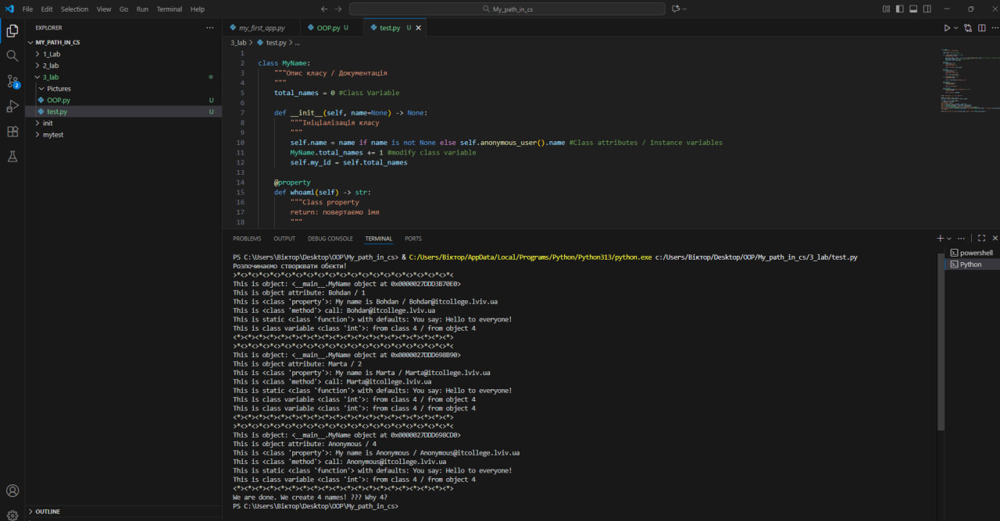
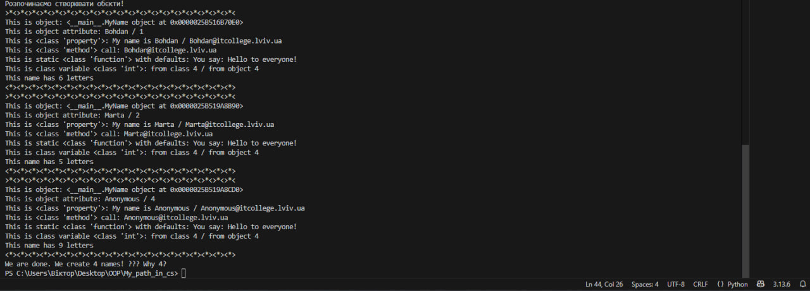

# Звіт до роботи
## Тема: "Робота з Класами та Обєктами"
### Мета роботи:  Навчитись використовувати основні принципи ООП, розглянути кострукції побудови класу та створення обєктів та навчитись працювати з ними

---
### Виконання роботи
    ✅Під час роботи було виконано всю роботу з використанням Python codu and MarkDown комірками і навчився та зрозумів як працюють основи Python✅.

* Результати виконання індивідуального завдання №0(test)

<< Код успішно виконаний >>

---

* Результати виконання індивідуального завдання №2

<< Код успішно виконаний >>

---

*  Результати виконання індивідуального завдання №3

<< Код успішно виконаний >>

---

*  Результати виконання індивідуального завдання №4

<< Код успішно виконаний >>

---

*  Результати виконання індивідуального завдання №5

<< Код успішно виконаний >>

---

*  Результати виконання індивідуального завдання №6

<< Код успішно виконаний >>

---

*  Результати виконання індивідуального завдання №7

<< Код успішно виконаний >>

---

*  Результати виконання індивідуального завдання №8

<< Код успішно виконаний >>

---

*  Результати виконання індивідуального завдання №9

<< Код успішно виконаний >>

---

## Висновки:
- Я навчився створювати класи та визначати їхні атрибути й методи.
- Я зрозумів, як створювати об'єкти класів і використовувати їх у програмі.
- Я освоїв принципи ООП, зокрема, як правильно працювати з атрибутами та методами класів в програмі.

---