# Звіт до роботи
## Тема: "Робота з Класами та Обєктами"
### Мета роботи:  Навчитись працювати з Класами та його основними конструкціями;

---
### Виконання роботи
    ✅Під час роботи було виконано всю роботу і навчився працювати з Класами та його основними конструкціями✅.

* # Результати виконання Індивідуального завдання №1 #

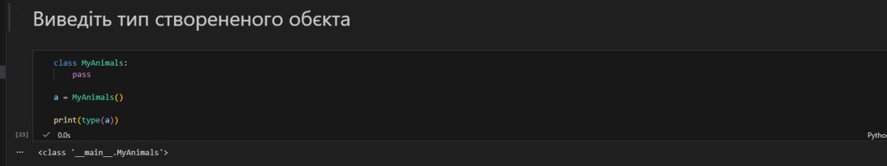

<< Код успішно виконаний >>

---

* ### Результати виконання Індивідуального завдання №2 ###

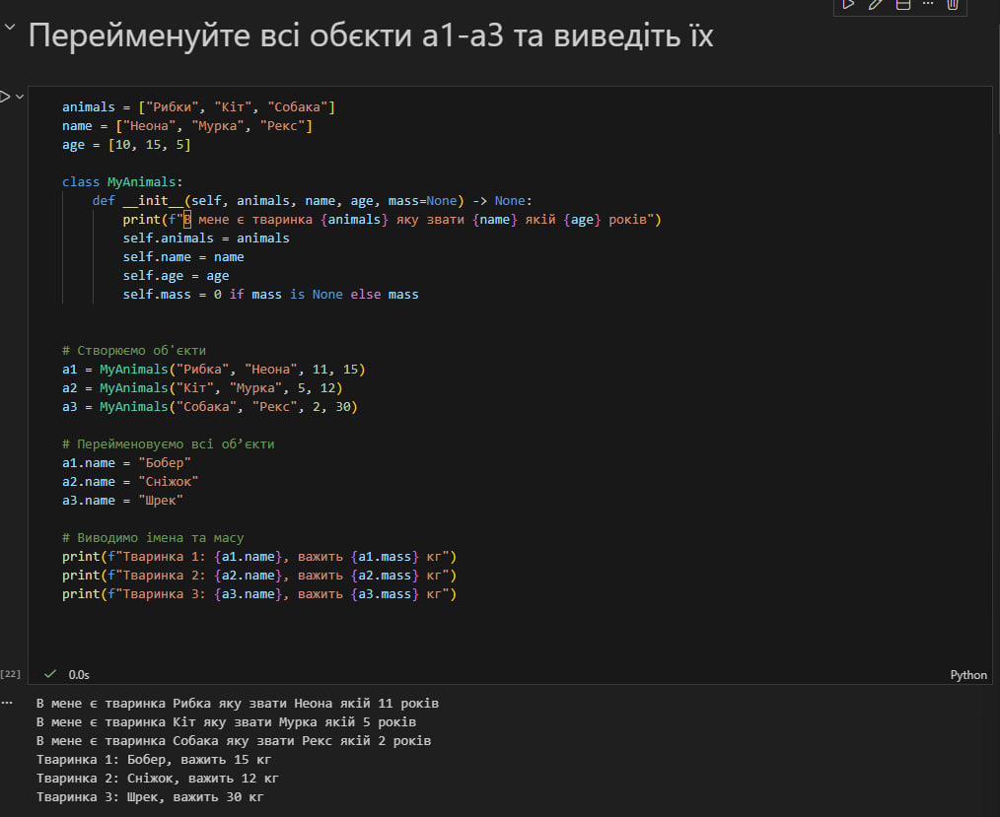

<< Код успішно виконаний >>

---

* ### Результати виконання Індивідуального завдання №3 ###

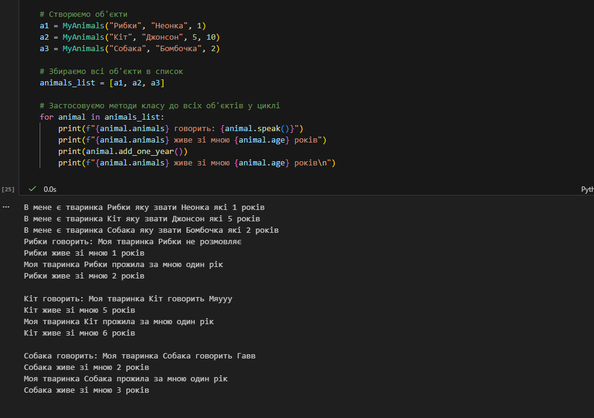

<< Код успішно виконаний >>

---

* ### Результати виконання Індивідуального завдання №4 ###

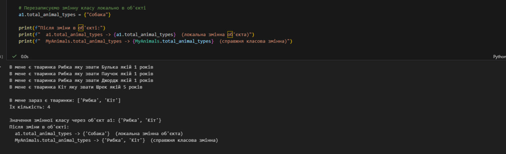

<< Код успішно виконаний >>

---

* ### Результати виконання Індивідуального завдання №5 ###

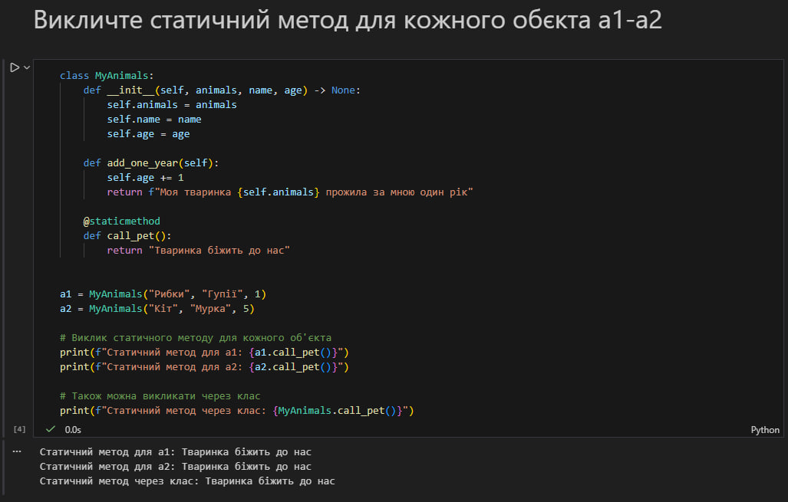

<< Код успішно виконаний >>

---

* ### Результати виконання Індивідуального завдання №6 ###

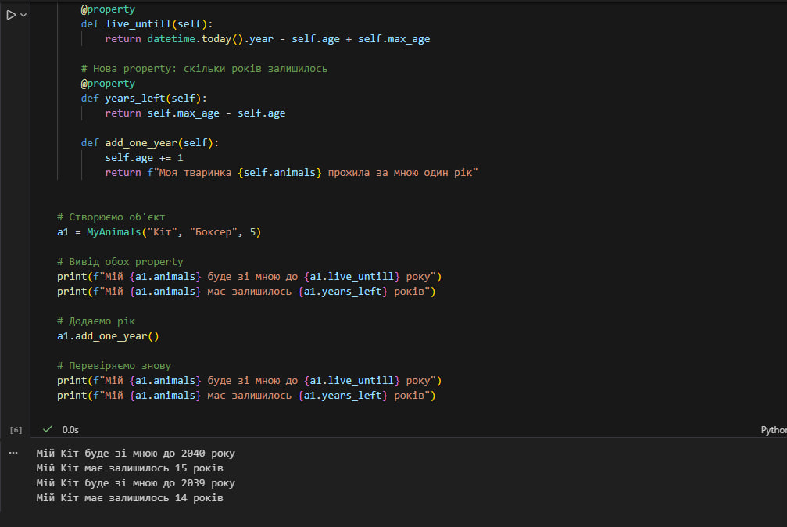

<< Код успішно виконаний >>

---

* ### Результати виконання Індивідуального завдання №7 ###

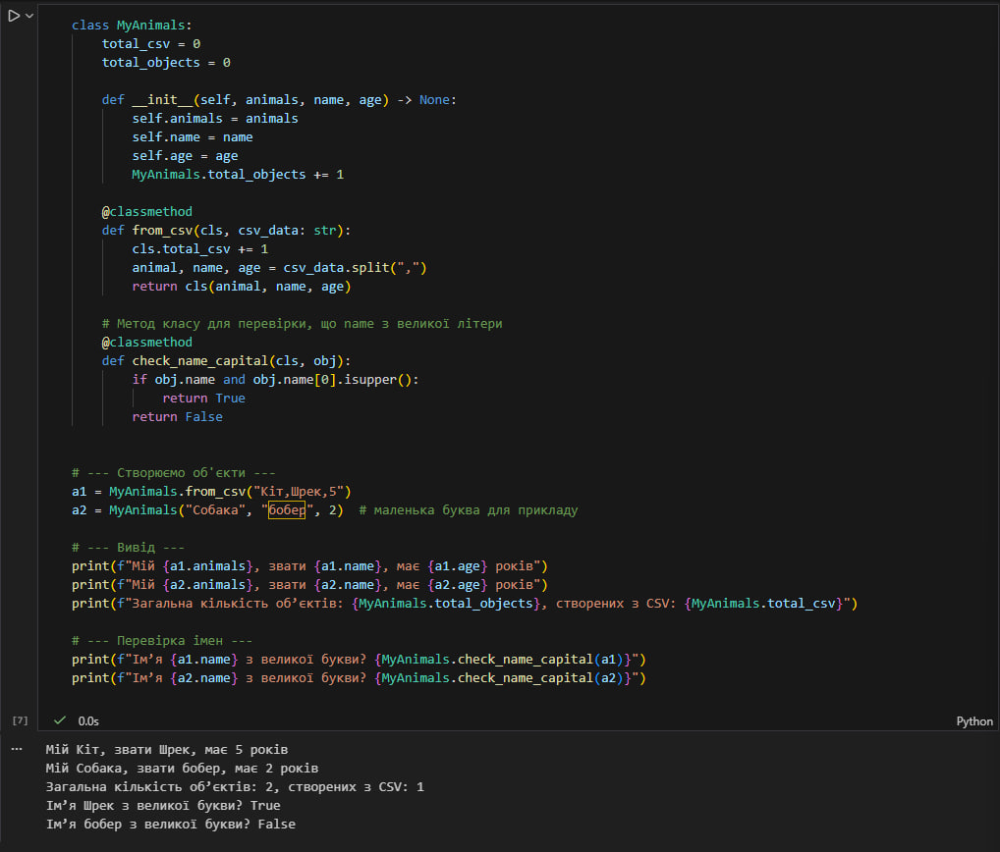

<< Код успішно виконаний >>

---

* # Результати виконання Класного завдання №1 #

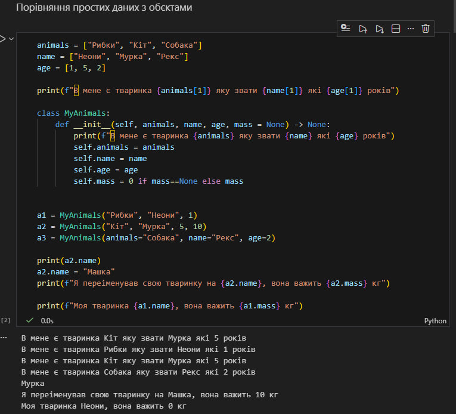

<< Код успішно виконаний >>

---

* ### Результати виконання Класного завдання №2 ###

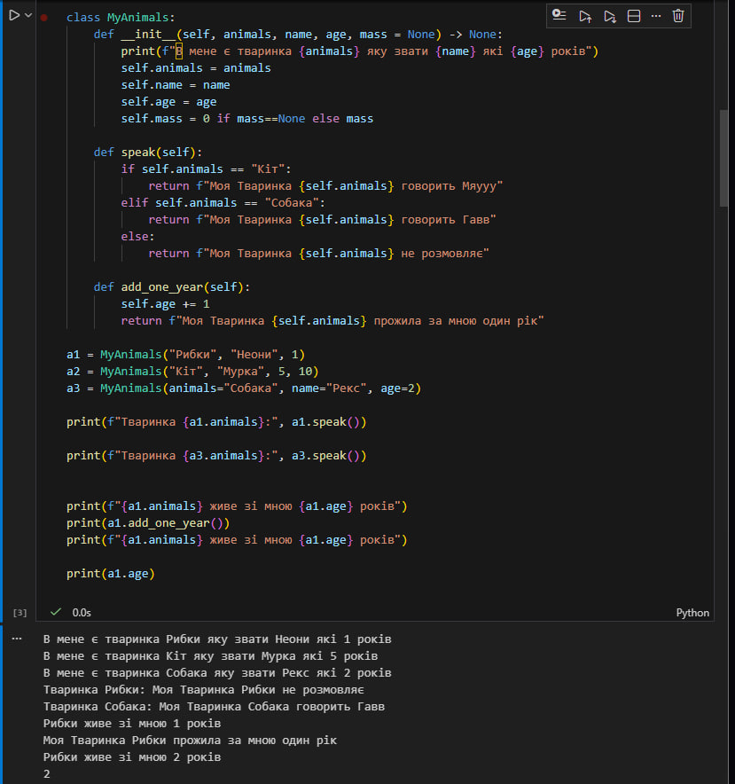

<< Код успішно виконаний >>

---

* ### Результати виконання Класного завдання №3 ###

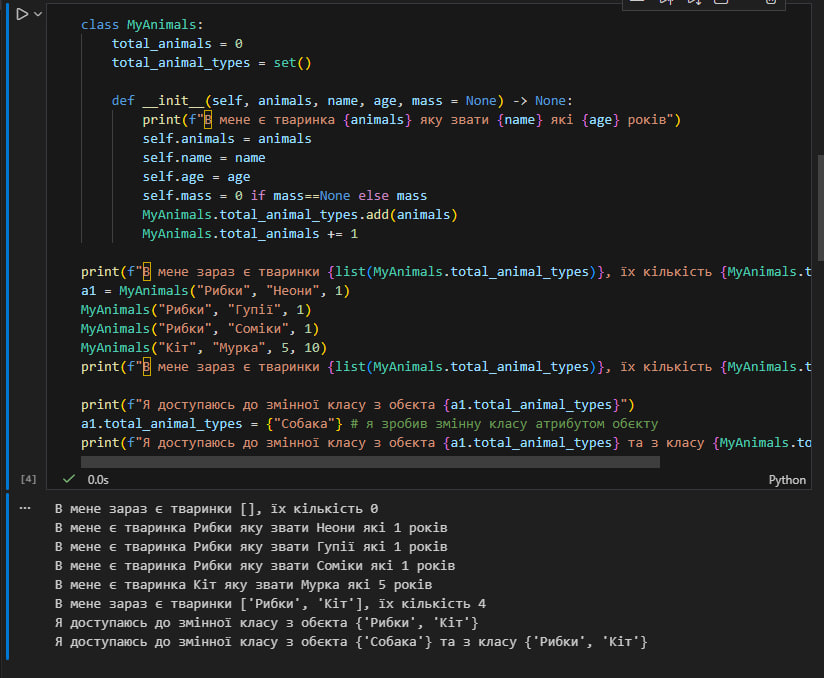

<< Код успішно виконаний >>

---

* ### Результати виконання Класного завдання №4 ###

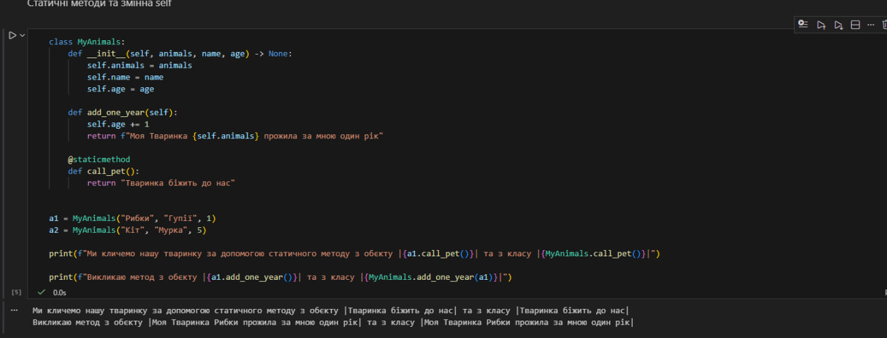

<< Код успішно виконаний >>

---

* ### Результати виконання Класного завдання №5 ###

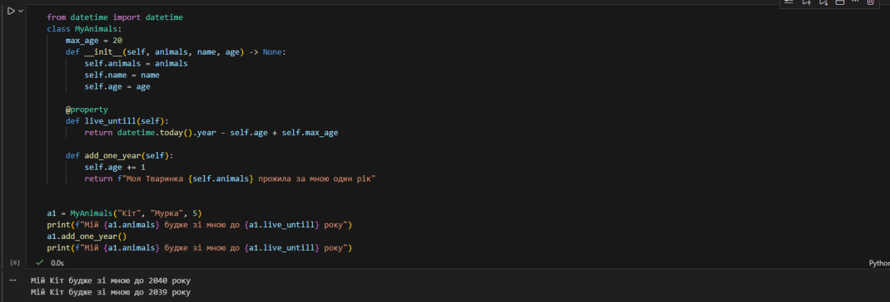

<< Код успішно виконаний >>

---

* ### Результати виконання Класного завдання №6 ###

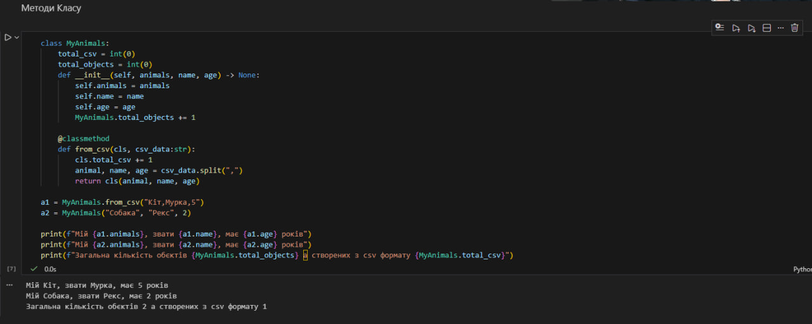

<< Код успішно виконаний >>

---

* ### Результати виконання Класного завдання №7 ###

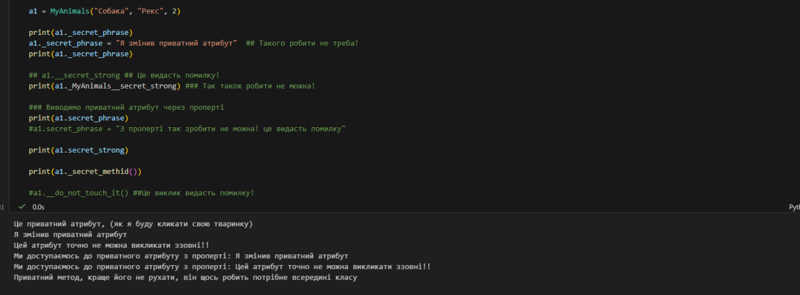

<< Код успішно виконаний >>

---

* ### Результати виконання Класного завдання №8 ###

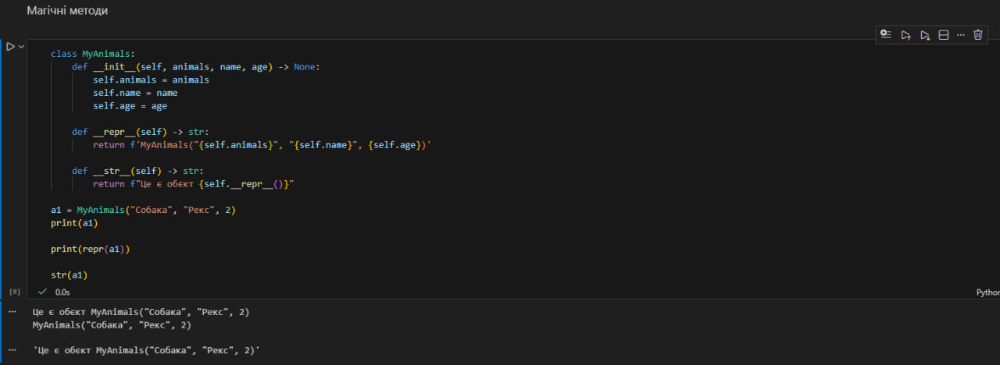

<< Код успішно виконаний >>

---

* ### Результати виконання Класного завдання №9 ###

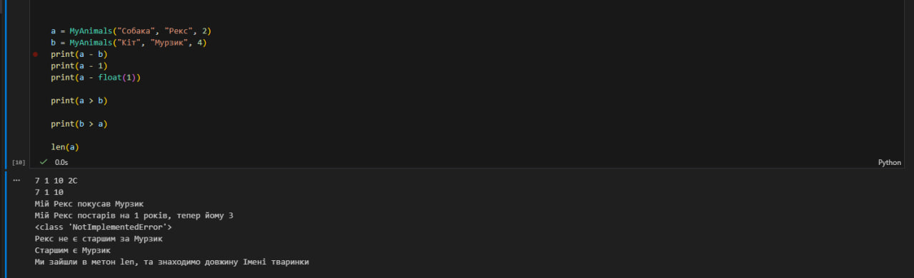

<< Код успішно виконаний >>

---

## Висновки:
- Я Навчився працювати з Класами та його основними конструкціями; 
- Зрозумів як їх використовувати в моїх задачах
- Зрозумів які існують класи та їх призначення

---