# Звіт до роботи
## Тема: "Основні парадигми ООП"
### Мета роботи: Ознайомитись з ключовими поняттями об’єктно-орієнтованого програмування (ООП) у Python та навчитися реалізовувати їх у власних класах на прикладі ігрової симуляції.  ;

---
### Виконання роботи
    ✅Під час роботи було виконано всю роботу і навчився працювати з Класами та його основними конструкціями✅.

* # Результати виконання Індивідуального завдання №1 #

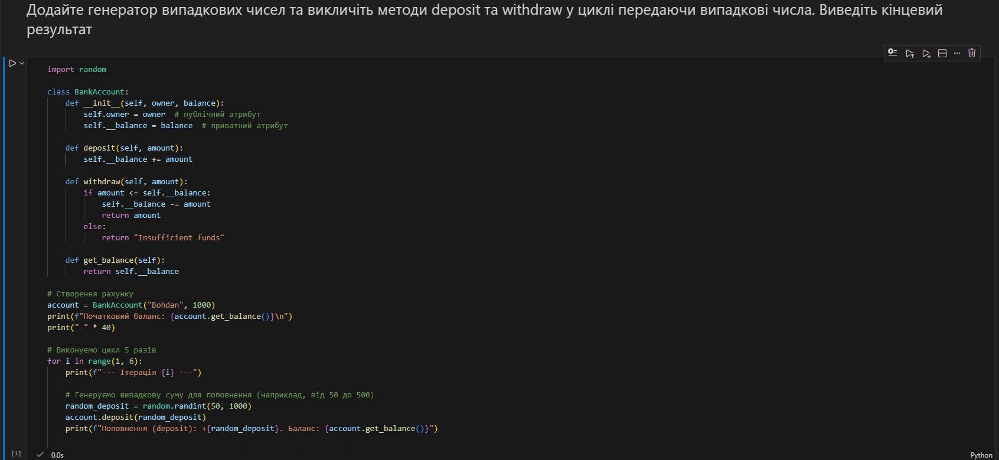 
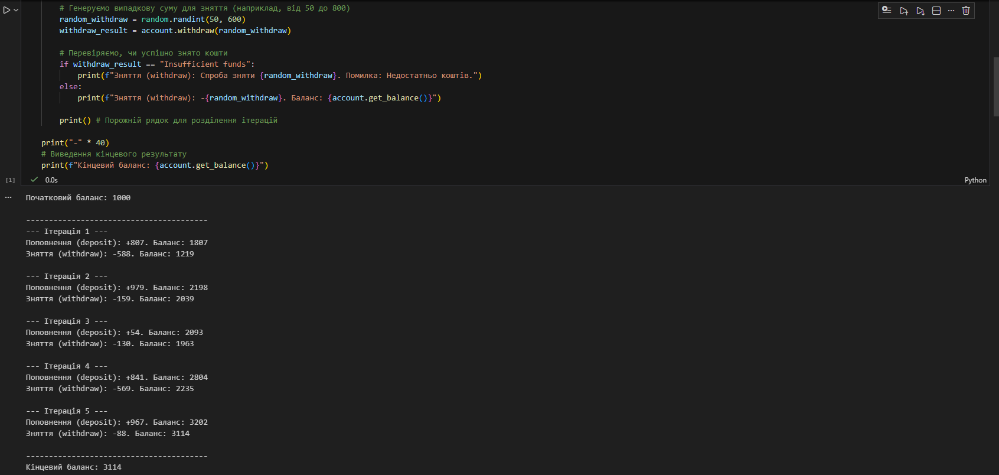

<< Код успішно виконаний >>

---

* ### Результати виконання Індивідуального завдання №2 ###

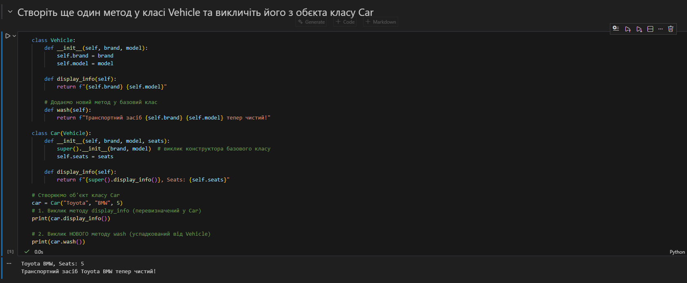

<< Код успішно виконаний >>

---

* ### Результати виконання Індивідуального завдання №3 ###

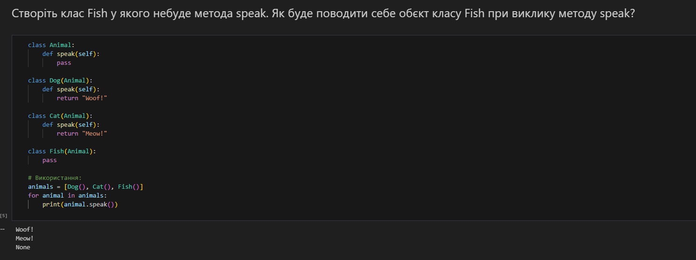

<< Код успішно виконаний >>

---

* ### Результати виконання Індивідуального завдання №4 ###

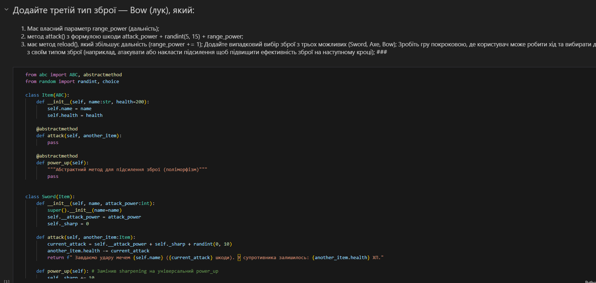
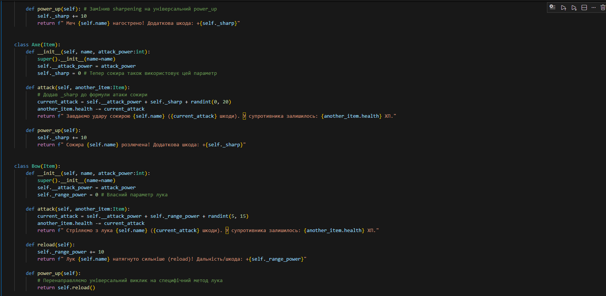
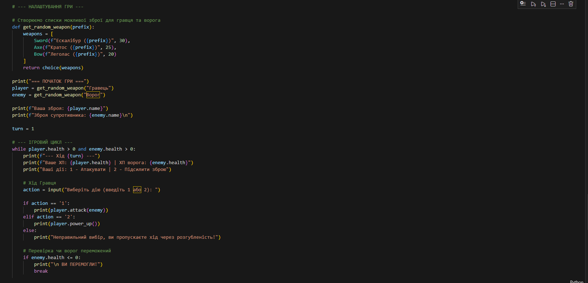
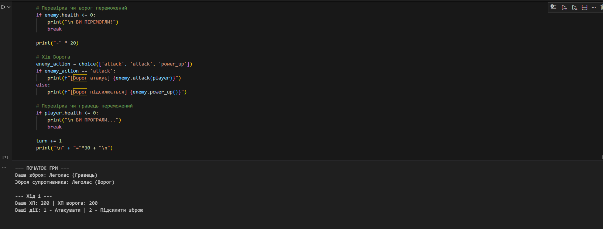

<< Код успішно виконаний >>

---

* # Результати виконання Класного завдання №1 #

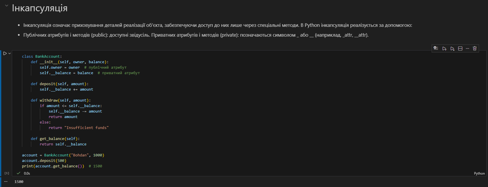

<< Код успішно виконаний >>

---

* ### Результати виконання Класного завдання №2 ###

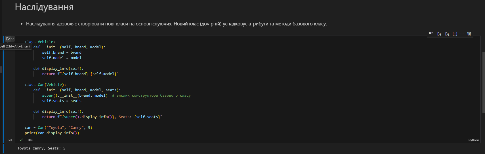

<< Код успішно виконаний >>

---

* ### Результати виконання Класного завдання №3 ###

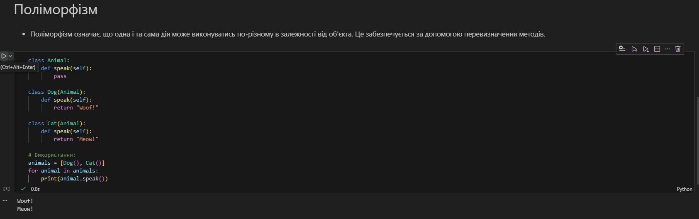

<< Код успішно виконаний >>

---

* ### Результати виконання Класного завдання №4 ###

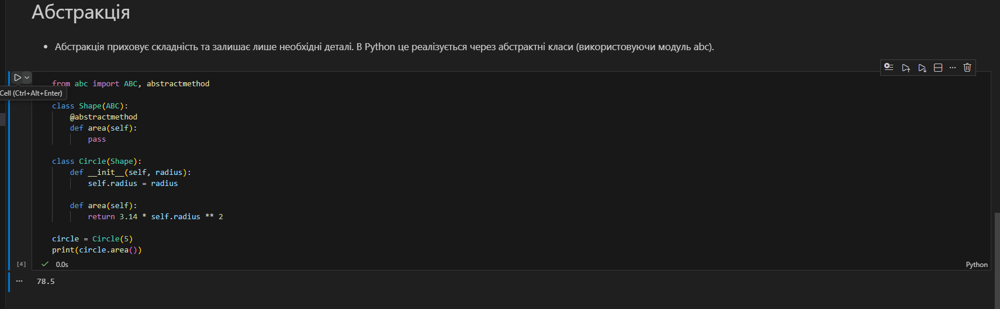

<< Код успішно виконаний >>

---

## Висновки:
- Завдяки цій роботі я навчився використовувати інкапсуляцію, щоб приховувати приватні дані об'єктів і керувати доступом до них лише через спеціальні методи.
- Я опанував механізм наслідування, що дозволило мені ефективно створювати нові класи на базі існуючих, уникаючи дублювання коду.
- Я зрозумів принцип поліморфізму на прикладі ігрових персонажів, де різні об'єкти виконують однакову дію (attack) у свій унікальний спосіб.
- На практиці я навчився застосовувати абстракцію для проектування чіткої структури програми, де базовий клас задає обов'язкові правила для всіх підтипів зброї. 

---

