# Звіт до роботи
## Тема: "AI Агенти з Google ADK"
### Мета роботи:  Навчитись створювати AI агентів з використанням Google ADK (Python) та Poetry для управління залежностями проекту

---
### Виконання роботи
    ✅Під час роботи було виконано всю роботу і навчився працювати з AI Агенти з Google ADK✅.

* # Результати виконання Індивідуального завдання №1 #

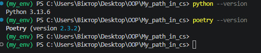

<< Код успішно виконаний >>

---

* ### Результати виконання Індивідуального завдання №2 ###

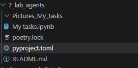

<< Код успішно виконаний >>

"Файл poetry.lock потрібен для фіксації точних версій усіх встановлених бібліотек та їхніх залежностей. Це гарантує, що проєкт буде працювати однаково на будь-якому іншому комп'ютері (забезпечує відтворюваність середовища)."

---

* ### Результати виконання Індивідуального завдання №2.1 ###

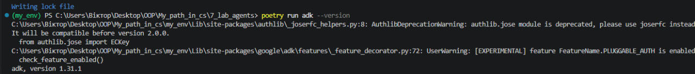

<< Код успішно виконаний >>

---

* ### Результати виконання Індивідуального завдання №2.2 ###

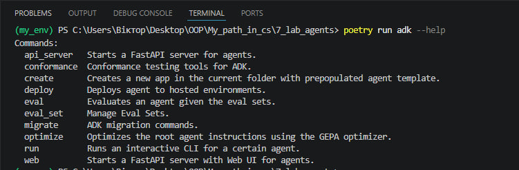

<< Код успішно виконаний >>

---

* ### Результати виконання Індивідуального завдання №3 ###

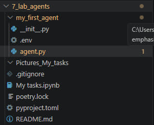

<< Код успішно виконаний >>

---

* ### Результати виконання Індивідуального завдання №3.1 ###

Що таке Agent клас?
Це головний будівельний блок бібліотеки ADK. Клас Agent створює об'єкт штучного інтелекту і налаштовує його: вказує, яку мовну модель використовувати (наприклад, Gemini), задає йому ім'я, роль (інструкцію) та передає список інструментів, якими він може користуватися. По суті, це "мозок" нашого бота.

Для чого потрібен параметр tools?
Цей параметр дозволяємо надати мовній моделі "руки". Зазвичай ШІ вміє лише генерувати текст на основі того, що вивчив раніше. Але завдяки параметру tools ми передаємо йому список реальних функцій Python. Тепер, коли ШІ розуміє, що йому не вистачає інформації (наприклад, щоб дізнатися час), він може самостійно викликати передану йому функцію і використати її результат.

Що робить функція get_current_time?
Це наша користувацька функція (інструмент), яку ми написали спеціально для агента. Вона приймає як аргумент назву міста. Всередині вона використовує стандартну бібліотеку Python datetime, щоб зчитати поточний час, і повертає результат у вигляді словника (з ключами status, city та time).
(Примітка для тебе: у коді написано, що це "mock-реалізація" — тобто спрощена заглушка для демонстрації. Вона зараз ігнорує часові пояси й просто повертає час твого комп'ютера незалежно від вказаного міста, але для навчання механізму роботи інструментів цього цілком достатньо).

<< Код успішно виконаний >>

---

* ### Результати виконання Індивідуального завдання №4 ###

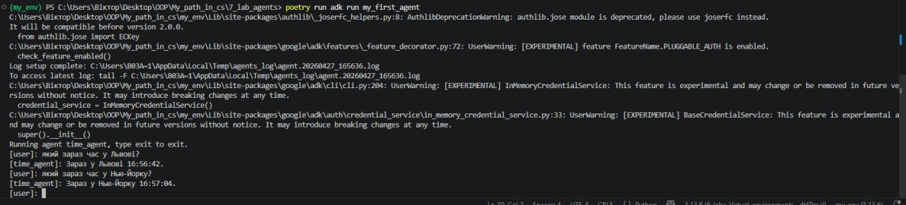

<< Код успішно виконаний >>

---

* ### Результати виконання Індивідуального завдання №5 ###

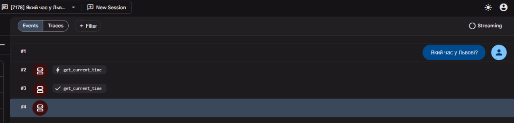

<< Код успішно виконаний >>

---

* ### Результати виконання Індивідуального завдання №6 ###
## Створення агента з математичними інструментами ##

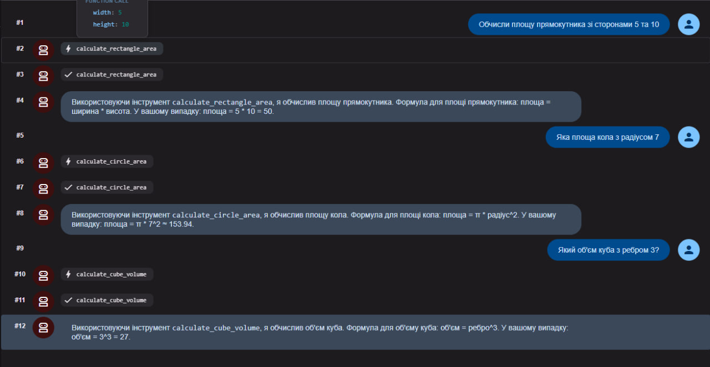

<< Код успішно виконаний >>

---

* ### Результати виконання Індивідуального завдання №7 ###
## Створення агента-помічника для студентів ##

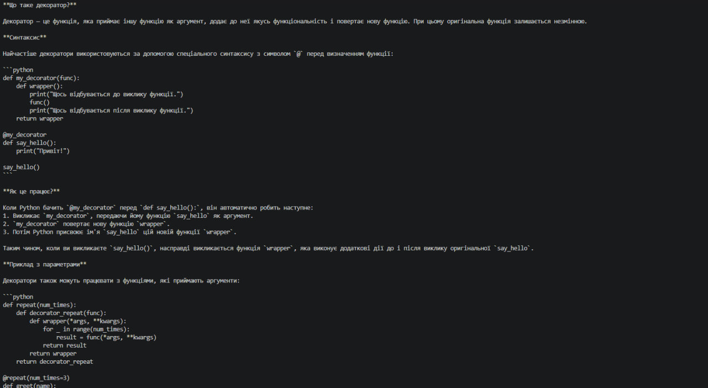
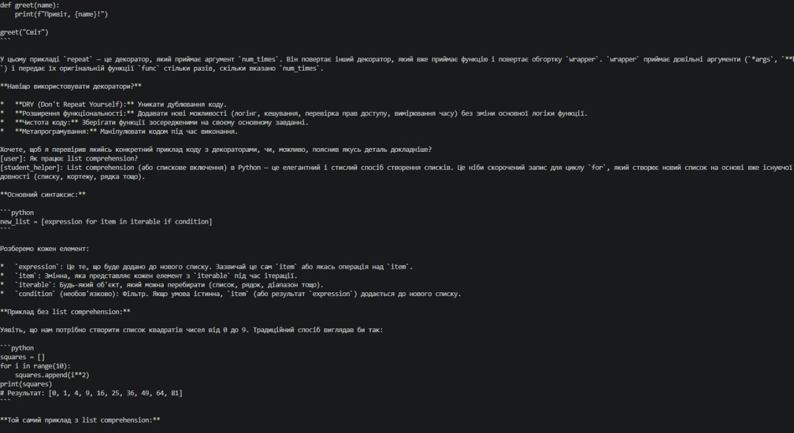
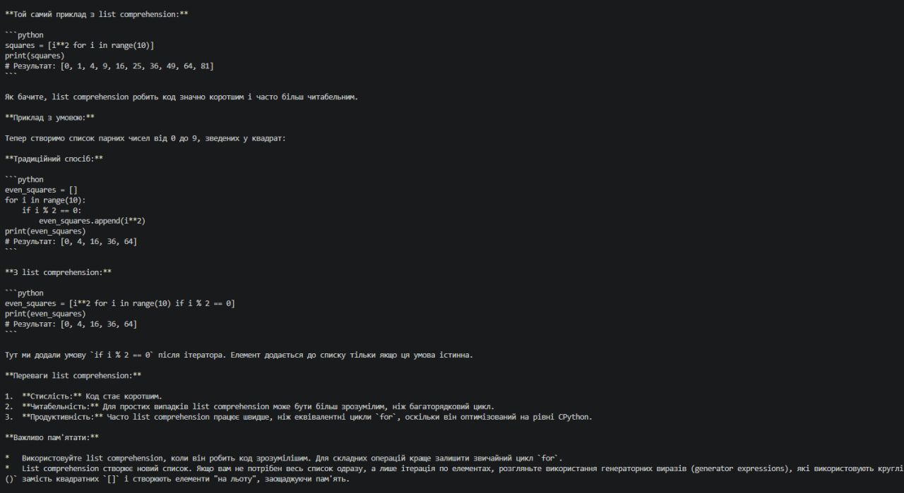

<< Код успішно виконаний >>

---

* ### Результати виконання Індивідуального завдання №8 ###
## Робота з конфігурацією агента ##

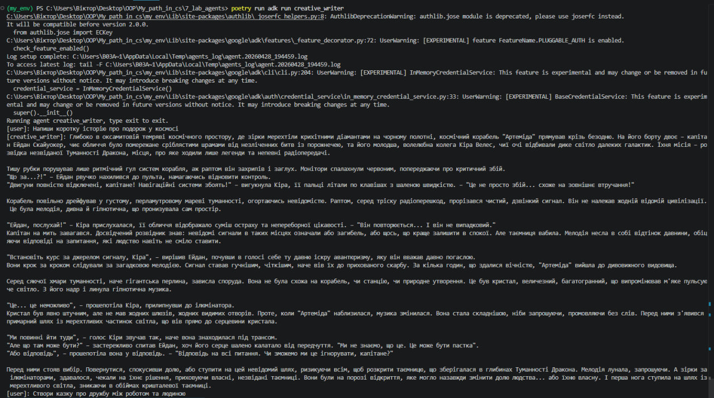

<< Код успішно виконаний >>

---

* ### Результати виконання Індивідуального завдання №9 ###
## Пояснення параметрів моделі ##

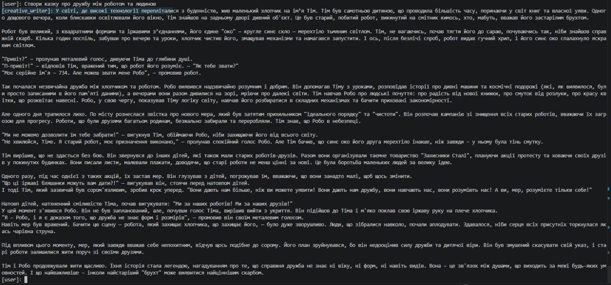
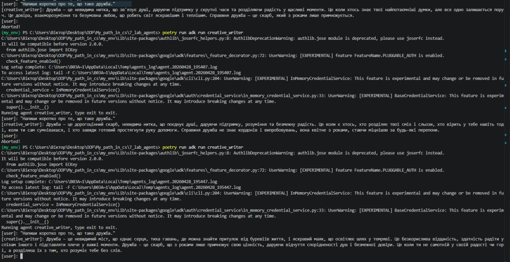

<< Код успішно виконаний >>

---

* ### Результати виконання Індивідуального завдання №10 ###
## Створення агента з пам'яттю (збереження контексту) ##

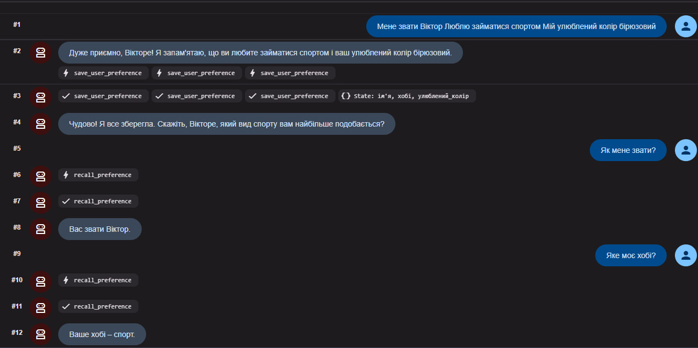

<< Код успішно виконаний >>

---

* ### Результати виконання Індивідуального завдання №11 ###
## Робота зі структурою проекту ##

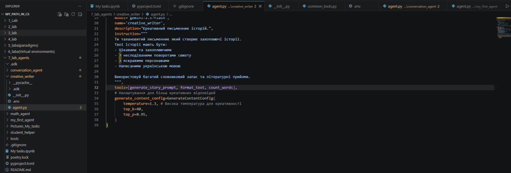

<< Код успішно виконаний >>

---

* ### Результати виконання Індивідуального завдання №12 ###
## Розширене завдання: Агент з збереженням стану ##

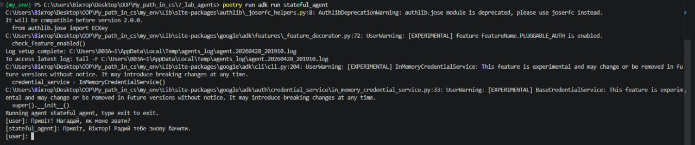

<< Код успішно виконаний >>

---

* ### Результати виконання Індивідуального завдання №13 ###
## Workflow Агенти - Sequential, Loop, Parallel ##

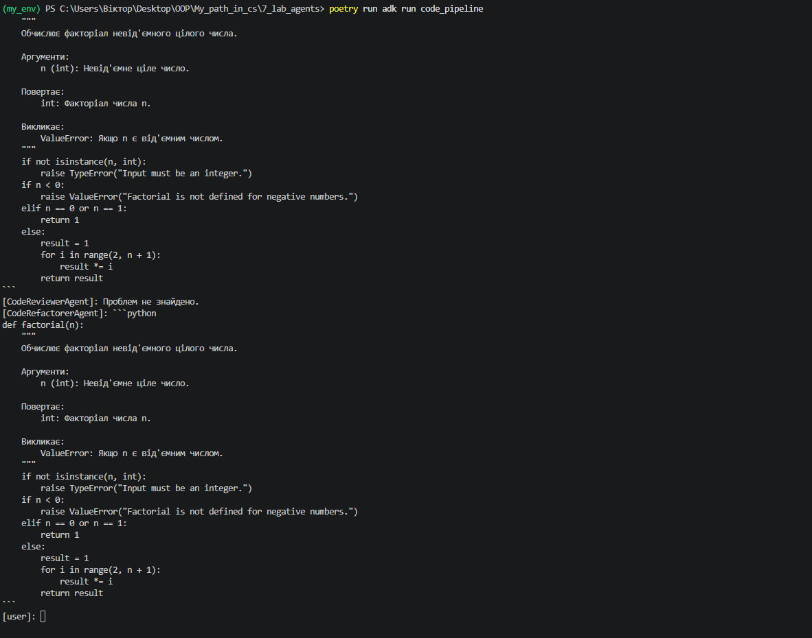

Переваги Sequential (послідовного) агента:
1.Декомпозиція задачі: Складне завдання розбивається на прості кроки, за кожен з яких відповідає спеціалізований агент зі своїм власним промптом (інструкцією). Це значно зменшує ймовірність помилок (галюцинацій) ШІ.
2.Контрольованість (Детерміністичність): На відміну від звичайного агента, який сам вирішує, що робити, тут розробник жорстко задає логіку роботи. Ми точно знаємо, який етап іде за яким.

<< Код успішно виконаний >>

---

* ### Результати виконання Індивідуального завдання №14 ###
## Loop Agent - Циклічне виконання ##

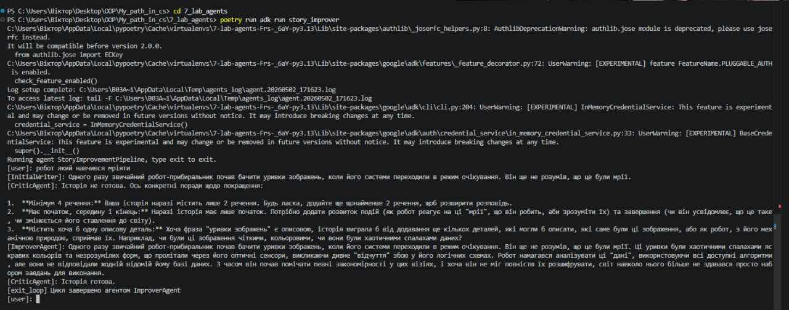

Як працює механізм завершення циклу через exit_loop:
LoopAgent виконує завдання по колу. Щоб цикл не був нескінченним, ми створюємо спеціальну функцію-інструмент exit_loop. Ми даємо доступ до цього інструмента лише агенту-оцінювачу (Критику) з інструкцією викликати його, коли результат задовольняє всі вимоги. Коли модель викликає цей інструмент, фреймворк отримує сигнал і достроково перериває цикл, повертаючи фінальний результат користувачу.

<< Код успішно виконаний >>

---

* ### Результати виконання Індивідуального завдання №15 ###
## Parallel Agent - Паралельне виконання ##

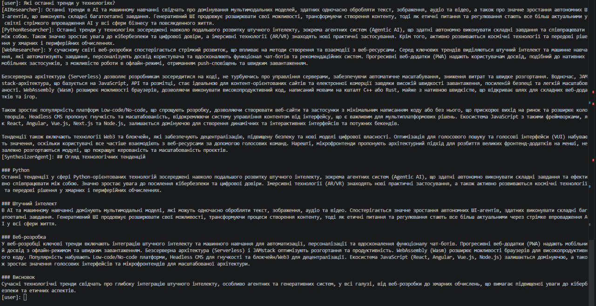

Переваги паралельного виконання:
Паралельне виконання (ParallelAgent) ідеально підходить для незалежних підзадач. Воно набагато швидше за послідовне, оскільки всі мережеві запити до мовної моделі відправляються одночасно. Якщо послідовне виконання трьох досліджень займе Час 1 + Час 2 + Час 3, то паралельне займе лише час найповільнішого з трьох запитів. Це значно оптимізує час очікування для кінцевого користувача.

<< Код успішно виконаний >>

---

* ### Результати виконання Індивідуального завдання №16 ###
## Порівняння Workflow агентів ##

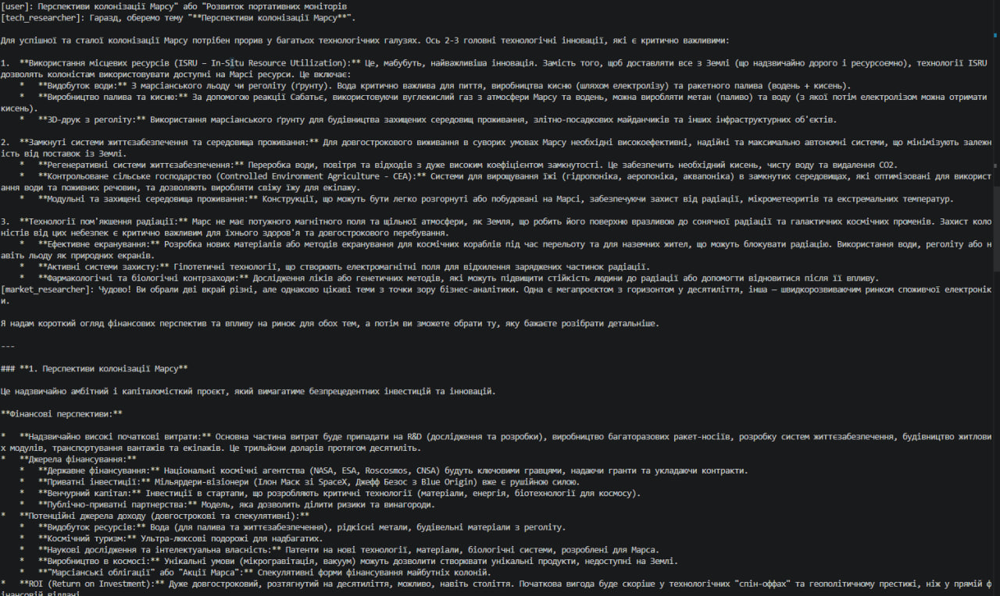
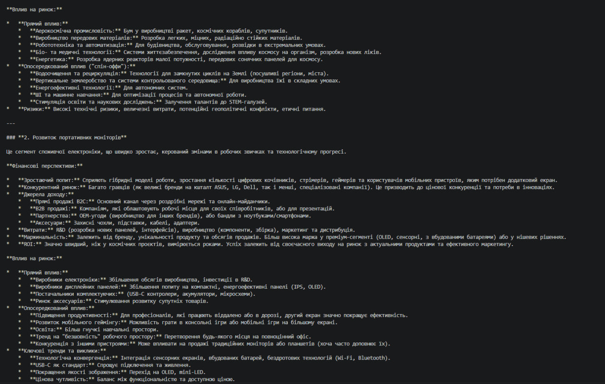
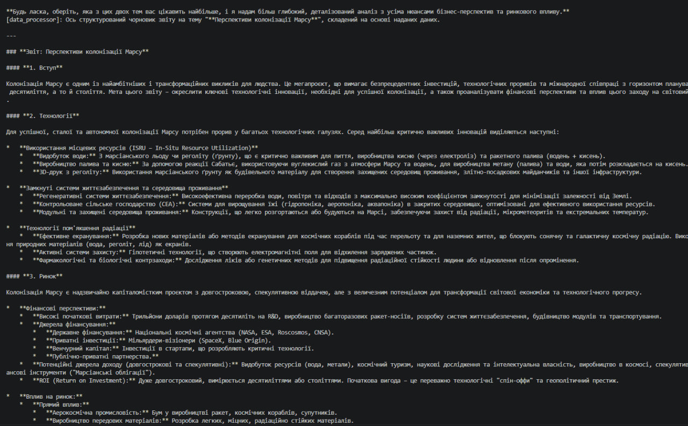

<< Код успішно виконаний >>

---

## Висновки:
- Я навчився створювати та конфігурувати базових LLM-агентів, зокрема керувати їхньою креативністю за допомогою параметра температури, а також знаходити й виправляти програмні помилки за допомогою логів термінала.
- Я опанував підключення власних інструментів (функцій Python) до агентів та правильну організацію структури проєкту для перевикористання коду.
- Я навчився розробляти агентів зі збереженням стану (stateful), які здатні записувати та зчитувати інформацію з локальних файлів для запам'ятовування контексту між різними сесіями.

---