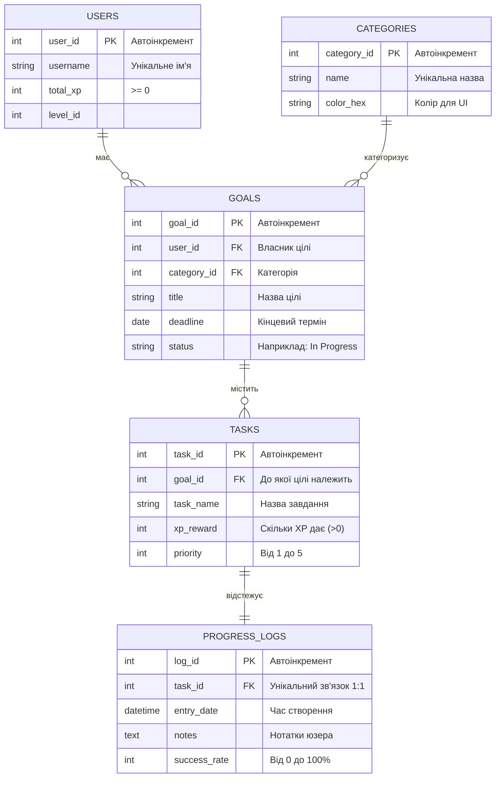

# Схема бази даних (Progress Hub API)

Моя схема бази даних відносно Task_progression.

## Візуальна ER-діаграма зв'язків

## Опис таблиць та зв'язків

1. **`users` (Користувачі)**
   Головна таблиця. Зберігає ім'я, рівень та загальну кількість заробленого досвіду (XP).
   *Зв'язок:* Один користувач може мати багато цілей (1:N до `goals`).

2. **`categories` (Категорії)**
   Довідник категорій (наприклад: Навчання, Спорт, Робота). Кожна має свій колір для відображення на фронтенді.
   *Зв'язок:* Одна категорія може застосовуватися до багатьох цілей (1:N до `goals`).

3. **`goals` (Цілі)**
   Глобальні плани користувача (наприклад: "Вивчити Python"). Мають дедлайн та статус виконання.
   *Зв'язок:* Одна ціль розбивається на багато завдань (1:N до `tasks`).

4. **`tasks` (Завдання)**
   Конкретні кроки для досягнення цілі. Мають пріоритет (1-5) та винагороду в XP.
   *Зв'язок:* Одне завдання має строго один запис про фінальний прогрес (1:1 до `progress_logs`).

5. **`progress_logs` (Логи прогресу)**
   Таблиця для збереження результату виконання конкретного завдання. Включає відсоток успіху (0-100%) та текстові нотатки.

## Обґрунтування типів даних та Індексація

У цьому проєкті використано такі підходи:

1. **`String` vs `Text`:**
   * Для коротких полів (назви категорій, імена юзерів, заголовки) використано `String(50)` або `String(100)` (в SQL це `VARCHAR`). Це обмежує пам'ять і робить пошук швидким.
   * Для поля `notes` у таблиці `ProgressLogs` свідомо обрано тип **`Text`**. Користувач може написати там ціле есе про те, як він виконував завдання. Тип `Text` оптимізований для зберігання великих обсягів тексту без жорстких лімітів на кількість символів.

2. **`Date` vs `DateTime`:**
   * У таблиці `Goals` для дедлайну використано `Date` (лише рік, місяць, день), оскільки для глобальної цілі точний час (години і хвилини) не має значення.
   * У таблиці `ProgressLogs` для `entry_date` використано `DateTime`, оскільки нам важливо знати точну секунду, коли користувач зафіксував свій прогрес.

3. **Індекси (Indexes) для швидкого пошуку:**
   База даних автоматично створює індекси (внутрішні каталоги для миттєвого пошуку) для всіх Primary Keys (`user_id`, `task_id` тощо). 
   * Крім цього, ми додали параметр `unique=True` для поля **`username`** (у таблиці Users) та **`name`** (у таблиці Categories). Це не лише забороняє дублікати, але й автоматично створює **унікальний індекс**. Завдяки цьому пошук користувача під час авторизації (`db.query(User).filter(User.username == ... )`) відбувається миттєво, навіть якщо в базі буде мільйон записів.

---

## Захист даних на рівні БД (CHECK Constraints)

У проєкті реалізовано такі перевірки на рівні таблиць:

1. **Таблиця `Users`:**
   * `check_total_xp_positive`: Гарантує, що `total_xp >= 0`. Досвід користувача ніколи не може стати від'ємним через баг у системі нарахування.

2. **Таблиця `Tasks`:**
   * `check_xp_reward_positive`: Гарантує, що `xp_reward > 0`. Не можна створити завдання, яке нічого не дає або забирає XP.
   * `check_priority_range`: Обмежує `priority BETWEEN 1 AND 5`. Захищає від того, щоб користувач не створив завдання з "зламаним" пріоритетом (наприклад, 999), яке поламає сортування на фронтенді.

3. **Таблиця `ProgressLogs`:**
   * `check_success_rate_range`: Гарантує, що `success_rate BETWEEN 0 AND 100`. Відсоток успіху не може бути фізично більшим за 100% або меншим за нуль.