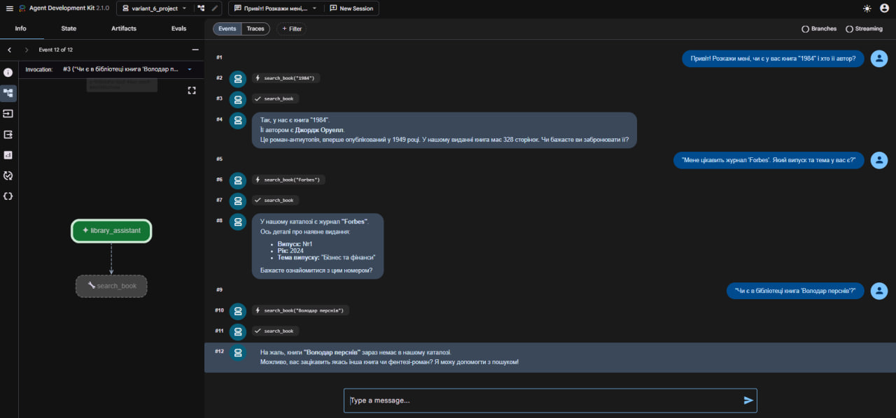

# Варіант 6 — Агент бібліотечного каталогу
# Залік
**Ім'я:** Віктор Сатановський

**Група:** КН-32

## Опис завдання
Необхідно реалізувати систему обліку книг та журналів, яка демонструє принципи ООП та роботу з AI-агентом.

### ООП-завдання:
1. **Абстрактний клас `LibraryItem`**: має атрибути `title`, `year: int` та абстрактний метод `get_info() -> dict`.
2. **Класи `Book` та `Magazine`**: успадковують `LibraryItem` та реалізують `get_info()`.
   - `Book` додає поля `author` та `pages: int`.
   - `Magazine` додає поля `issue: int` та `topic`.
3. **Клас `Library`**: 
   - Зберігає елементи у приватному списку `__catalog` (реалізація інкапсуляції).
   - Має методи `add(item)`, `find(title: str) -> LibraryItem | None` та `list_all()`.

### AI-агент:
* **Інструмент (tool):** Функція `search_book(title: str) -> dict`, яка всередині створює об'єкт `Library`, наповнює його даними, викликає `find(title)`, отримує дані через `get_info()` та повертає їх. Якщо не знайдено — повертає `{"found": False}`.
* **Промпт агента:** Агент є бібліотечним помічником. Він шукає книги та журнали за назвою та надає інформацію про них українською мовою.

### Реалізація ООП-парадигми
У файлі `agent.py` реалізовано всі 4 основні парадигми ООП:
1. **Абстракція:** Створено абстрактний базовий клас `LibraryItem` з атрибутами `title`, `year` та абстрактним методом `get_info()`.
2. **Наслідування:** Створено класи `Book` (додані атрибути `author`, `pages`) та `Magazine` (додані атрибути `issue`, `topic`), які успадковують `LibraryItem` та деталізують метод `get_info()`.
3. **Інкапсуляція:** Створено клас `Library`, який надійно зберігає елементи у приватному списку `__catalog`. Доступ до списку здійснюється виключно через публічні методи `add()` та `find()`.
4. **Поліморфізм:** Метод `list_all()` у класі `Library` викликає `get_info()` для різних типів об'єктів (як для книг, так і для журналів), обробляючи їх відповідним чином.

### Реалізація AI-агента
* **Інструмент (Tool):** Написано функцію `search_book(title)`, яка ініціалізує об'єкт бібліотеки, наповнює його тестовими даними та виконує пошук через метод `find()`. Якщо об'єкт не знайдено, інструмент коректно повертає `{"found": False}`.
* **Налаштування агента:** Створено глобальну змінну `root_agent`. Промпт модифіковано таким чином, щоб агент виконував роль бібліотечного помічника, використовував інструмент пошуку та відповідав виключно українською мовою.

---

## Демонстрація роботи
