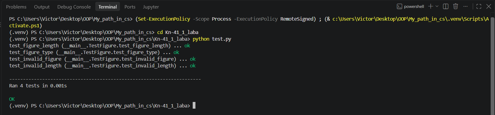
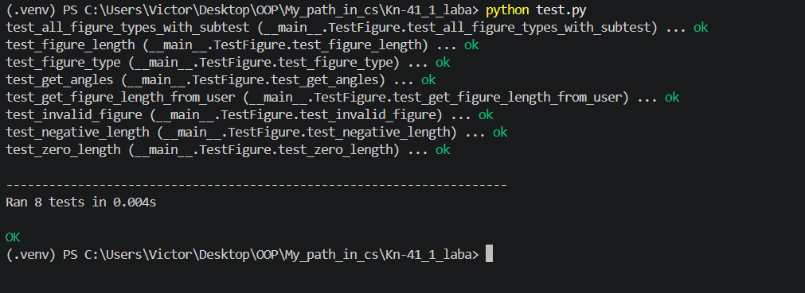
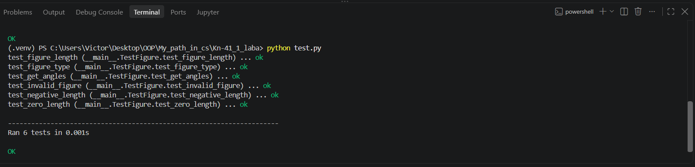

# Звіт до роботи
## Тема: "Загальне тестування та юніт-тести"
### Мета роботи: Тестування перевіряє правильність роботи програми за підготовленими сценаріями. Юніт-тест перевіряє невелику самостійну частину коду.  ;

---
### Виконання роботи
    ✅Під час роботи було виконано всю роботу і навчився працювати з Класами та його основними конструкціями✅.

* ### Результати виконання Класного завдання (Перший приклад-4) ###

 

<< Код успішно виконаний >>

---

* ### Результати виконання Індивідуального завдання (Розширені можливості unittest) ###

<< Код успішно виконаний >>

---

* ### Результати виконання Індивідуального завдання (Перший приклад-6,7) ###

<< Код успішно виконаний >>

---

## Висновки:
- Опанував роботу з параметризованими тестами за допомогою self.subTest, що дозволяє ефективно тестувати набори вхідних даних без написання надлишкового коду для кожного випадку окремо.
- Навчився використовувати модуль unittest.mock та декоратор @patch для ізоляції юніт-тестів від зовнішніх залежностей та інтерактивного введення даних input()
- Дослідив механізм виявлення помилок у разі неспівпадіння типів даних (AssertionError: '15' != 15) та успішно виправив логіку функції.
- Закріпив навички організації структури автоматизованих тестів у проєкті та запуску наборів тестів через консольний інтерфейс python -m unittest. 

---

